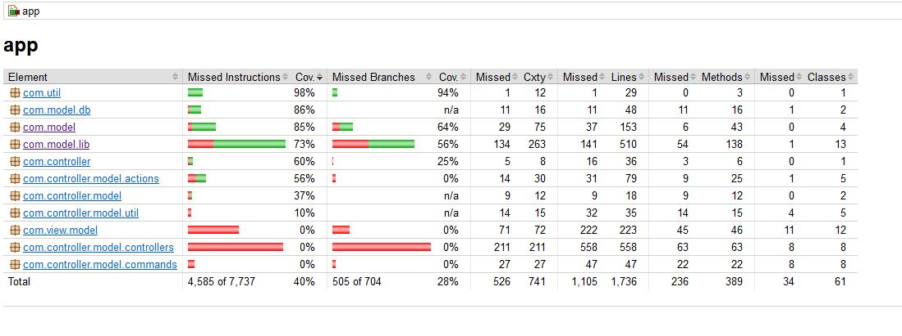

# A2 - Stuff lending System

## Note:
The default language is English and if you want to run the Swedish language version use the command line: ```./gradlew run -q --console=plain --args="SWE"```

Project for Assignment 2

A project template based on gradle and a gitlab pipeline. You should always build and run the application using gradle regularely.

[design.md](design.md) contains the architectural design of the application.

## Note:
I realize that I will not have the time to finish all the requirements of this project before the deadline today. 
- What I have is a working application that does everything it should.
- Unit tests and a coverage that looks like 
- The class diagram
- The sequence diagram i.e., the [Design document](design.md)

The parts that are missing are:
- Object diagram
- At this writing the tests, which I might have time to do some of before deadline. In that case they will be in the [test report](testreport.md)
- 
I don't have any excuses or explanations. I just haven't planned my time nor project well enough to be able to finnish in time and that is all on me.

I still wanted to submit what I have done and I expect I will get some feedback on that and hopefully another possibility to re-submit it with all corrections and the parts that are missing at this point.

I don't think I have been ashamed of handing in anything before, but there's a first time for everything but I don't like the feeling.