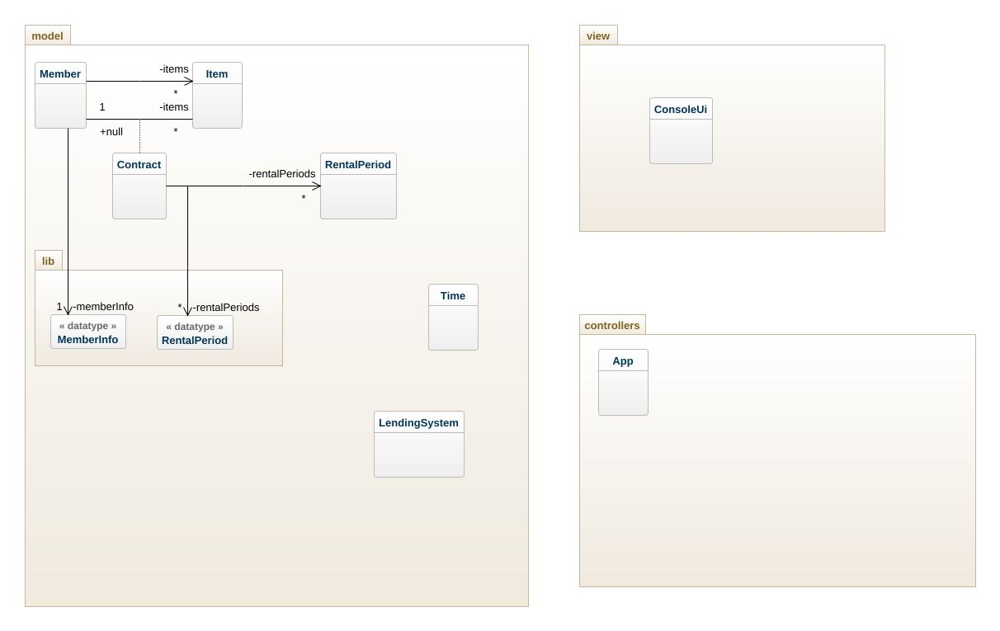
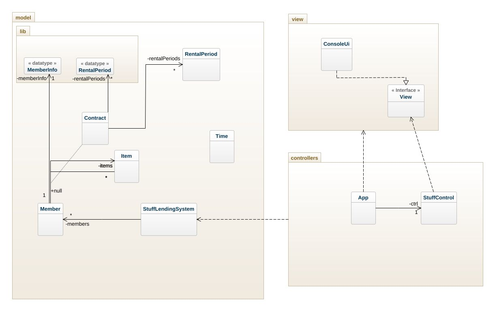
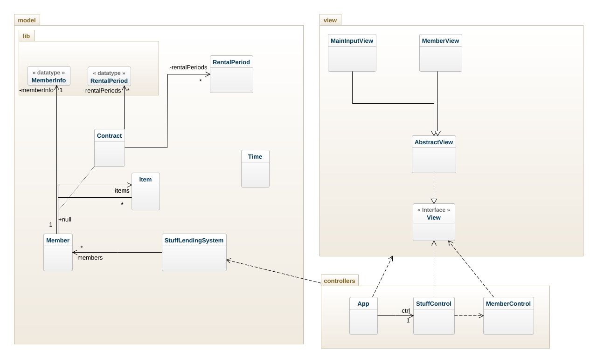
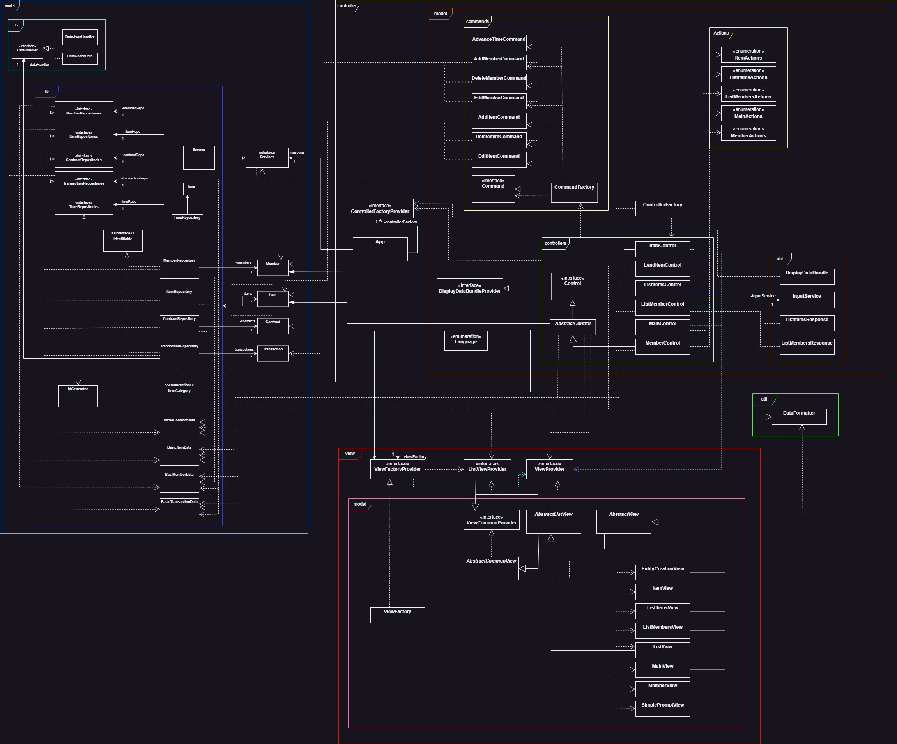

# Stuff Lending System - Design
This document describes the design according to the requirements presented in assignment 2 and the extended requirements.

## Architectural Overview
The application uses the model-view-controller (MVC) architectural pattern. The view is passive and gets called from the controller. The view may only read information from the model, not directly change it.

This depicts the first layout of the intended structure of the application.

Which changed to this:

Then after a while it changed a little and had this form:

Admittedly nothing much happened during this period and no new ideas surfaced, yet.

### Idea to a Menu Layout

Since I wasn't happy with how things were going and I had no real good ideas I instead started on looking how the menu flow of the application should look like and came up with this basic idea:

I stuck with this idea and this is basically how the menu system of the application works.

## Detailed Design
### Class Diagram
The final class diagram came to look like this.

### Sequence Diagram
The sequence diagram to add a member got pretty intense and took a lot of time to finish.
Having said that I think it was one of the things in this assignment that I actually learned the most from and I'm very happy about having done that because this has been a tool that has been missing in my toolbox for a long time but something that I always regarded as a very useful tool. Now I feel confident to start using this in coming projects and it will be a great help.

We start the sequence at the run method that is called on the ListMembersControl and from there we follow it through to where we return to the run command again after having added a new member which will now be visible in the listing. Certain simplifications have been done for paths that either don't belong to the adding member functionality or where the results are irrelevant to the successful creation of a the new member. It also makes the diagram cleaner and easier to read since the omitted part don't have anything useful to add to the sequence.

